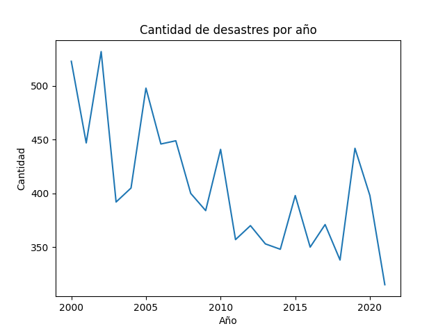
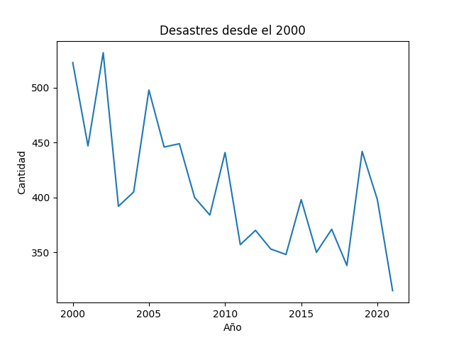
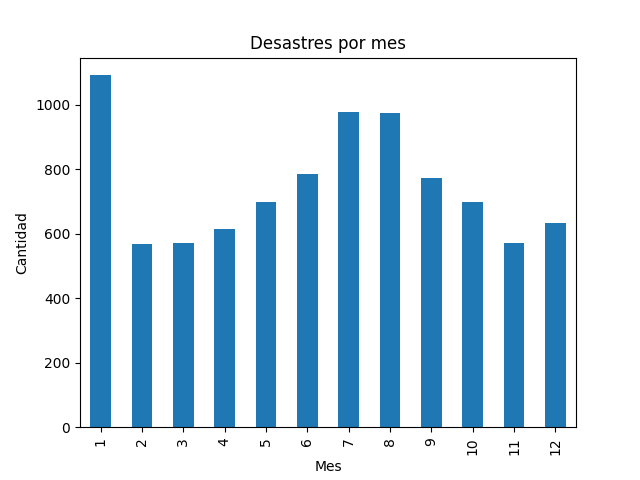
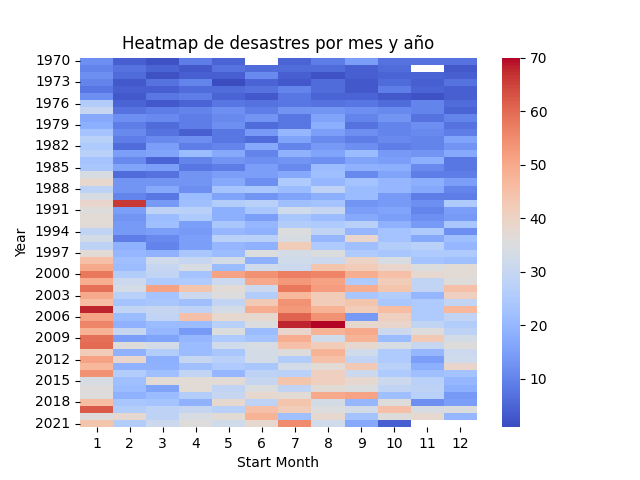
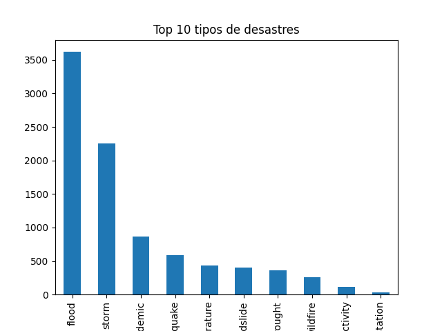
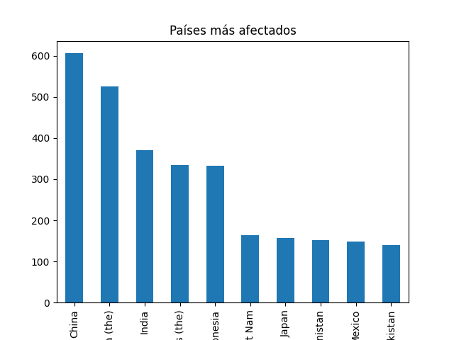
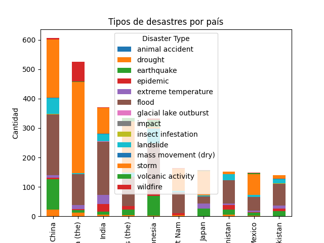

# 🌍 Proyecto ETL - Análisis de Desastres Naturales

---

## 📌 Descripción del proyecto

Este proyecto implementa un proceso ETL (Extract, Transform, Load) en Python aplicado a un dataset de desastres naturales. El objetivo es realizar un análisis exploratorio para identificar patrones temporales, estacionales y geográficos.

El flujo del trabajo se divide en:

* **Extract:** carga y exploración inicial de los datos
* **Transform:** limpieza y preparación del dataset
* **Load:** generación de visualizaciones para el análisis

---

## 📁 Estructura del proyecto

```
proyecto_desastres_naturales/
├── extract/
│   └── extract.py
├── transform/
│   └── transform.py
├── load/
│   └── load.py
├── outputs/
│   └── (gráficos en formato PNG)
├── main.py
└── README.md
```

La carpeta `outputs/` contiene los gráficos generados automáticamente.

---

## 📊 Conjunto de datos

El dataset incluye información sobre desastres naturales a nivel global.

Variables utilizadas:

* Year
* Start Month
* Disaster Type
* Country

Estas variables permiten analizar el comportamiento temporal y geográfico de los desastres.

---

## ⚙️ Instalación

```
pip install pandas matplotlib seaborn
```

---

## ▶️ Ejecución

```
python main.py
```

Al ejecutar, se generan automáticamente los gráficos en la carpeta:

```
outputs/
```

---

## 🔄 Proceso ETL

---

### 1. Extract

El módulo `extract.py` se encarga de:

* Cargar los datos desde una URL con pandas
* Mostrar estructura del dataset
* Visualizar primeras filas
* Detectar valores nulos

Esta etapa permite conocer la calidad y estructura de los datos.

---

### 2. Transform

El módulo `transform.py` realiza:

#### ✔ Creación de fecha

Se combinan `Year` y `Start Month` en una nueva columna de tipo fecha.

#### ✔ Limpieza de datos

* Normalización de texto
* Eliminación de espacios
* Manejo de valores faltantes

#### ✔ Filtrado

Se seleccionan los datos de años recientes para análisis.

---

### 3. Load

El módulo `load.py`:

* Genera gráficos con matplotlib y seaborn
* Guarda automáticamente imágenes en `outputs/`
* Permite visualizar patrones en los datos

---

## 📈 Análisis de resultados

---

### 📈 Desastres por año



Se observa un incremento sostenido en la cantidad de desastres desde la década de 1980, con mayor crecimiento hacia fines de los 90 y principios de los 2000. Esto puede deberse tanto a una mayor frecuencia de eventos como a mejoras en los registros.

---

### 📉 Desastres en los últimos años



En las últimas décadas, la cantidad de eventos se mantiene alta, aunque con variaciones entre años. Esto indica una frecuencia sostenida de desastres.

---

### 📊 Desastres por mes



Se identifican meses con mayor concentración de eventos, lo que sugiere patrones estacionales asociados a fenómenos climáticos.

---

### 🔥 Heatmap temporal



El gráfico muestra la distribución de desastres por mes y año, evidenciando concentraciones en determinados períodos.

---

### 🌪️ Tipos de desastres



Predominan los desastres de origen climático, especialmente inundaciones y tormentas.

---

### 🌎 Países más afectados



Estados Unidos, China e India presentan mayor cantidad de eventos, posiblemente por su tamaño y diversidad climática.

---

### 🔄 Tipo de desastre por país



China e India concentran la mayor cantidad de desastres registrados, lo que puede atribuirse a su gran extensión territorial y diversidad climática. También se observa una presencia importante de Estados Unidos, aunque con una distribución más variada entre tipos de eventos. Asimismo, países como Filipinas o Bangladesh presentan valores elevados en fenómenos específicos como tormentas e inundaciones, lo que refleja una mayor vulnerabilidad asociada a su ubicación geográfica. En contraste, Japón y México se destacan por la ocurrencia de terremotos y actividad volcánica, vinculadas al cinturón de fuego del Pacífico.

---

## 🧠 Conclusiones generales

El análisis muestra que los desastres naturales presentan patrones claros:

* Aumento en el tiempo
* Distribución estacional
* Concentración geográfica

Esto demuestra que los eventos no ocurren de forma aleatoria, sino que dependen de factores climáticos y geográficos.

---

## 🚀 Posibles mejoras

* Analizar impacto (muertes, daños)
* Incorporar más variables
* Crear dashboards interactivos
* Aplicar modelos de predicción

---

## 👤 Autor

Trabajo práctico desarrollado por: Ivan Quiottaso  
Materia: Procesamiento de Datos.

